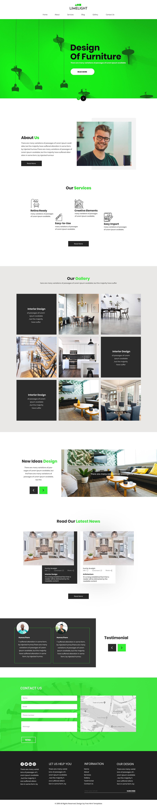

# Responsive Page Design
Responsive Website Design using HTML, CSS and Bootstrap.

This is a responsive website design of Interior Design

## Table of contents

- [Overview](#overview)
  - [Screenshot](#screenshot)
  - [Links](#links)
- [My process](#my-process)
  - [Built with](#built-with)
- [Author](#author)

## Overview

### Screenshot

### Links

- Solution URL: https://github.com/hayamione/task
- Live Site URL: https://hayamione.github.io/task/

### Built with

- Semantic HTML5 markup
- CSS custom properties
- Simple Bootstrap 3
- Mobile-first workflow

## Author

- Website - [Haya Zubair](https://hayamione.netlify.app/)

